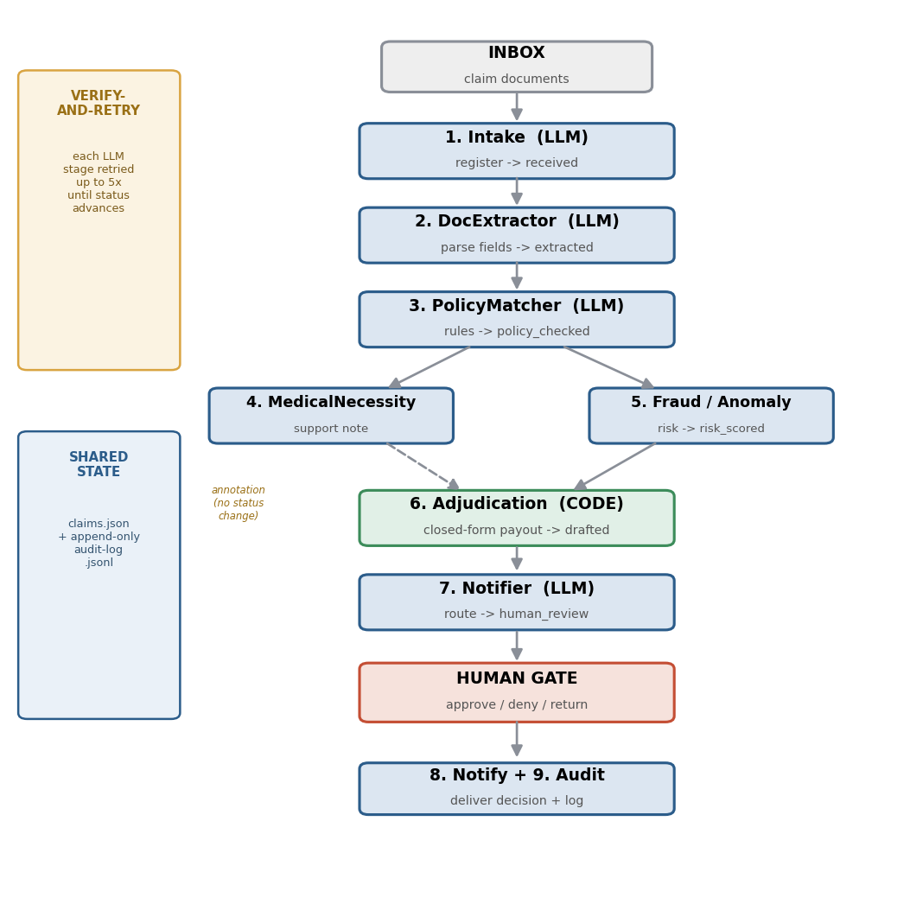

# ClaimPilot — an open multi-agent pipeline for veterinary insurance claims adjudication

ClaimPilot is a self-hosted, **multi-agent** system that turns an incoming veterinary insurance claim
(invoice + records) into a **drafted adjudication recommendation** — extract → policy-match → risk-score →
adjudicate — and then **stops for a human** to approve, deny, or return it. It runs on a single commodity
machine on top of the [OpenClaw](https://github.com/openclaw/openclaw) gateway, with cheap-tier LLM agents
and a deterministic adjudication step.

> **Status: research prototype.** Validated only on synthetic data. It drafts; a licensed human decides.
> No claim is ever paid or denied autonomously. Not a clinically or actuarially validated product.

---

## Why this exists

The North American pet-insurance market reached **USD 5.2 B in written premium and 7.03 M insured pets in
2024**, implying millions of document-heavy, rules-bound claims per year — a strong fit for agentic
automation *with a human gate*. ClaimPilot is a reproducible reference implementation plus an honest,
measured evaluation of how such a pipeline actually behaves once deployed.

## Architecture

Nine roles operate over file-based shared state; the status chain is strict and auditable:

```
received → extracted → policy_checked → risk_scored → adjudication_drafted → human_review
```



| # | Role | Engine | Function |
|---|------|--------|----------|
| 1 | Intake | gpt-5-mini | register inbound claim documents |
| 2 | DocExtractor | gpt-5-mini | parse invoice + records into structured fields |
| 3 | PolicyMatcher | gpt-5-mini | coverage, exclusions, deductible, waiting period → `policy_eval` |
| 4 | MedicalNecessity | gpt-5-mini | treatment-vs-diagnosis support note |
| 5 | Fraud/Anomaly | gpt-5-mini | risk score + flags |
| 6 | **Adjudication** | **deterministic code** | closed-form payout + recommendation |
| 7 | Notifier | gpt-5-mini | route draft to the human gate |
| 8 | AuditLogger | gpt-5-mini | reconcile the immutable transition log |
| 9 | PatternReview | gpt-5.5 (weekly) | denial-rate drift, fraud clusters |

Every LLM stage is wrapped in a **verify-and-retry** loop; all deterministic work lives in code.

## Deployment options

**Human gate via existing tools.** Because it runs on a multi-channel gateway, drafts can be delivered and approve/deny/return decisions collected through the messaging tools a team already uses — Slack, Microsoft Teams, Discord, Telegram, or e-mail — with one gateway binding all of them and a reply or reaction advancing the claim. Tiered routing can send high-risk (over-approval-prone) claims to a senior reviewer.

**Local or headless cloud.** The same gateway and agent definitions deploy unchanged from a single board to a headless VPS or container, reachable over a secure overlay network (e.g., Tailscale) so authorised staff review from anywhere without exposing the service publicly. Any real-data deployment needs the usual data-protection posture (access control, encryption, retention, redundancy).

## Key findings

Evaluated on the released 150-claim benchmark, gpt-5-mini, with each configuration run twice.

**1. Multi-agent decomposition did not improve decision quality.**

| Configuration | Run 1 | Run 2 | Spread | Completion | LLM calls/claim | s/claim |
|---|---|---|---|---|---|---|
| Single-agent | 95.3% | 96.0% | 0.7 pts | 100% / 100% | 1 | 41.9 |
| Multi-agent  | 90.0% | 96.0% | 6.0 pts | 97.3% / 100% | 2 | 65.0 |

In run 2 the two architectures produced **identical dispositions on all 150 claims** (McNemar b=0, c=0).
The run-1 gap (b=9, c=1, p=0.0215) traces entirely to four claims that stalled between agent hand-offs.
Decomposition added an intermittent liveness failure mode, 2x the LLM calls, and +55% latency — without
adding decision quality. Performance comes from the **deterministic policy engine + document usability
gate**, which are common to every configuration.

**2. Per-claim session isolation is a reliability/latency trade, not an accuracy gain.**
Isolation off: 95.0% accuracy, 97.5% completion, 27.2 s/claim. Isolation on: 95.0-97.5% accuracy,
100% completion, 41.9 s/claim (+54% latency).

**3. Tool-protocol compatibility is a hard model-selection constraint.**
`o4-mini` and `gpt-5.4` are rejected by the gateway tool schema with HTTP 400 and cannot participate at
any accuracy; `gpt-5-mini` and `gpt-5.5` are accepted. Capability leaderboards do not report this.

**4. Don't make an LLM do arithmetic.** Adjudication as an LLM agent completed 0/10; in deterministic
code it is 100% with payout MAE $0.00.

**5. Coordination overhead dominates inference.** ~65 s of gateway/session start-up per agent invocation
against 3-8 s of model latency, so wall-clock scales with call count rather than token volume. One
auto-loading plugin blocking on a dead connection accounted for 137 s -> 52 s per claim once removed.

**6. The benchmark has a ceiling.** 96.0% (144/150) with oracle peril labels: six denials rest on
pre-existing-condition grounds that never appear in the claim document and are unrecoverable from it.

## Repository layout

```
config/        reference openclaw.json (JSON5), .env.example, telegram-block.txt
workspace/     agent definitions (SOUL.md per role), memory files, policy rules, sample claim
scripts/       deploy + run + evaluate
                 run-pipeline.sh / run-eval.sh   pipeline + batch evaluation
                 score_eval.py, cron-setup.sh, setup/start/stop
dataset/       150-claim corpus + ground truth + generate_corpus.py (seeded regenerator)
                 results_multi_run1/2.jsonl, results_no_isolation_40.jsonl
                 raw per-claim outputs for every run reported
figures/       paper figures (PNG)
ClaimPilot_figures.ipynb, make_figs.py   regenerate every figure from dataset/*.json
```

## Quick start

Prereqs: a Linux box, Node 24 (or 22.19+), `npm i -g openclaw@latest`, an OpenAI API key.

```bash
# 1. lay down the project
mkdir -p ~/openclaw-insurance && cp -r workspace ~/openclaw-insurance/
cp config/openclaw.json ~/.openclaw/openclaw.json        # gateway reads ~/.openclaw/openclaw.json
cp config/.env.example ~/.openclaw/.env                   # then fill it

# 2. secrets (on the box only)
#    OPENAI_API_KEY=sk-...   OPENCLAW_GATEWAY_TOKEN=$(openssl rand -hex 32)

# 3. validate + start
openclaw config validate && openclaw gateway restart && openclaw status

# 4. drop a claim and run one pass
cp ~/openclaw-insurance/workspace/samples/sample-claim-01.json ~/openclaw-insurance/workspace/inbox/
bash scripts/run-pipeline.sh
cat ~/openclaw-insurance/workspace/data/claims.json
```

Schedule hands-off operation with `scripts/cron-setup.sh` (every 5 min, `flock`-guarded; idle = $0).

## Reproduce the evaluation

```bash
# multi-agent pipeline
bash scripts/run-eval.sh        dataset/claims_dataset.json dataset/ground_truth.json 150

# each prints completion rate, disposition accuracy, payout MAE and a confusion matrix
```

Regenerate the corpus from the policy grammar (documents the construction procedure; a different
seed yields a different corpus, so the released pair remains the benchmark of record):

```bash
python3 dataset/generate_corpus.py --n 150 --seed 20260101 --out /tmp/regen
```

## Reproduce the figures

```bash
pip install matplotlib pillow
python3 make_figs.py          # or open ClaimPilot_figures.ipynb and run all cells
```

## Dataset

`dataset/claims_dataset.json` — 150 synthetic claims (no real client/patient data).
`dataset/ground_truth.json` — independent reference labels (disposition + payout + `policy_eval`).
Mix: 62 APPROVE / 22 PARTIAL / 48 DENY / 18 RETURNED; invoice mean $1,404; payout mean $1,301.

## Known gaps / roadmap

- No `returned` route in the orchestrator yet (the source of the 0% RETURNED recall) — add it next.
- Add a self-consistency / confidence check on the policy-matcher to cut the over-approval bias.
- Evaluate at full corpus scale and on de-identified real claims.

## License

MIT — see `LICENSE`.
